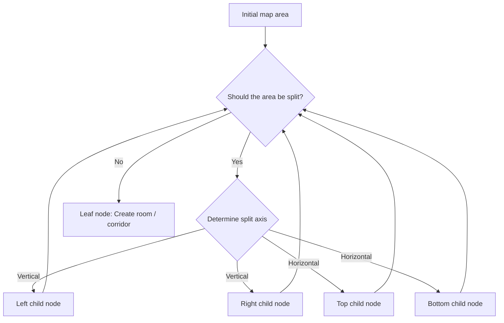
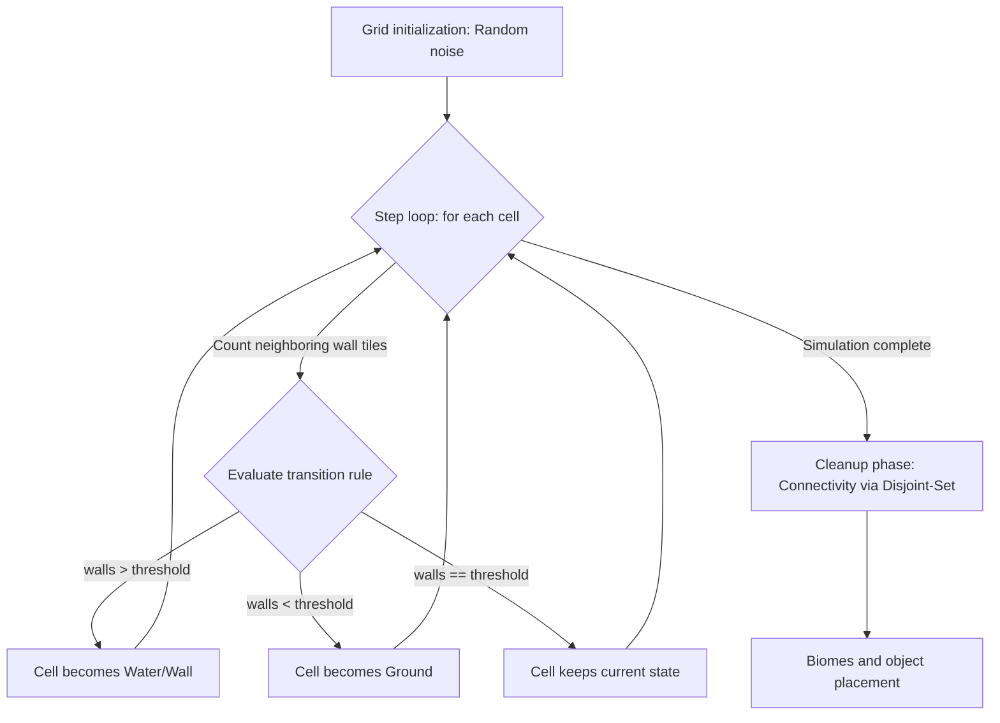
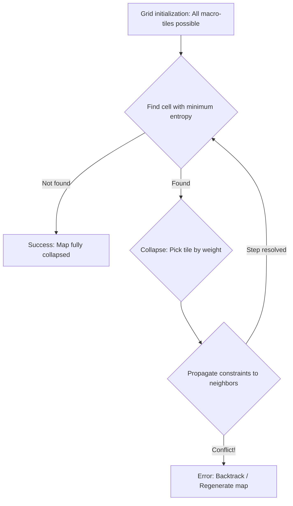

# ProcGen Lab: Procedural World Generation Laboratory


> **Languages:** [English](README.md) • [Русский](README.ru.md)
> 
## About

**ProcGen Lab** is an interactive platform for studying, visualizing, and experimenting with procedural content generation (PCG) algorithms. It provides a flexible environment for creating diverse maps and levels, highlighting the internal logic of each generator.

The laboratory is divided into three core generation modules, each using a fundamentally different algorithmic approach:

1. **Binary Space Partitioning (BSP)** — for structured room-based layouts (dungeons, buildings).
2. **Cellular Automata (CA)** — for organic, natural environments (caves, islands, biomes).
3. **Wave Function Collapse (WFC)** — for complex rule-based tile structures with guaranteed macro-level connectivity.

---

## Algorithm Overview

### 1. Binary Space Partitioning (BSP)

**General description:**
BSP recursively divides a 2D area into smaller rectangular sub-zones, building a hierarchical tree. This approach is ideal for generating structured layouts with clear boundaries — dungeon rooms, castle floors, or building interiors.



**Technical implementation:**
* **Partition tree:** Implemented via [`BspNode`](Source/BSP/Models/BspNode.cs), where each node stores its area bounds (`Area`) and references to child branches.
* **Smart axis selection:** [`BspProcessor.TryGetSplitOrientation()`](Source/BSP/Services/BspProcessor.cs) dynamically picks vertical or horizontal cuts based on the current area's aspect ratio, using `AspectRatioThreshold` from [`BspConfig`](Source/BSP/Resources/Definitions/BspConfig.cs).
* **Size constraints:** The `MinSplitSize` parameter limits split offsets, ensuring child nodes are always large enough to fit rooms with their required padding.
* **Layout generation:** Leaf nodes serve as containers for [`Room`](Source/BSP/Models/Room.cs) objects, which are then connected via MST pathfinding and corridor generation.

---

### 2. Cellular Automata (CA)

**General description:**
Cellular automata produce organic structures — caves, canyons, islands — by simulating growth or erosion. Each cell on the grid changes state based on its neighbors, transforming random noise into smooth, natural-looking forms.



**Technical implementation:**
* **Grid evolution:** Simulation is driven by [`AutomataSimulator`](Source/CellularAutomata/Services/AutomataSimulator.cs), which evaluates the 3×3 Moore neighborhood for each cell.
* **Transition rules:** Logic is controlled by `FillPercent` (initial fill density) and `WallTransitionThreshold` (threshold at which a cell solidifies).
* **Cleanup and connectivity:** Isolated regions are resolved using a **Union-Find** algorithm inside [`RegionAnalyzer`](Source/CellularAutomata/Services/RegionAnalyzer.cs) and [`RegionConnector`](Source/CellularAutomata/Services/RegionConnector.cs). They identify separate regions, flood-fill to merge them, remove structures smaller than `MinIslandSizeTiles`, and carve corridors to guarantee 100% traversability.
* **Biome layers:** FastNoiseLite integration in [`BiomeCreator`](Source/CellularAutomata/Services/BiomeCreator.cs) overlays noise layers for procedural biome distribution and smooth parameter blending.

---

### 3. Wave Function Collapse (WFC)

**General description:**
Wave Function Collapse is a constraint-solving algorithm inspired by quantum mechanics. Each cell in the grid starts in a "superposition" of all possible tiles. By collapsing cells one at a time and propagating constraints to neighbors, the algorithm transforms a chaotic grid into a fully consistent structure that satisfies all adjacency rules.



**Technical implementation:**
* **Entropy and collapse:** Managed by [`WfcSolver`](Source/WFC/Services/WfcSolver.cs). The algorithm picks the cell with the fewest valid options (`PickLowestEntropy`) and collapses it to a single tile using weighted probabilities from [`WfcWeightConfig`](Source/WFC/Resources/Definitions/WfcWeightConfig.cs).
* **Constraint propagation:** After each collapse, the solver iteratively narrows valid tile types for neighboring cells based on the socket compatibility table in [`MacroTileSocketMap`](Source/WFC/Services/MacroTileSocketMap.cs).
* **BSP topology hybrid:** A unique feature of this project — WFC can be overlaid on a macro-structure. When `UseBspTopology` is enabled in [`WfcConfig`](Source/WFC/Resources/Definitions/WfcConfig.cs), the BSP tree is converted into a level topology graph, and [`TopologyPlacer`](Source/WFC/Services/topology_placer/TopologyPlacer.cs) pre-constrains key paths to guarantee dungeon connectivity.

---

## Screenshots

> *(Screenshots will be added upon itch.io publication)*

---

## Getting Started

> ⚠️ This repository contains source code only (C#). Graphical assets are not included due to licensing restrictions — the project cannot be built as-is. Links to the original asset packs are listed in the Credits section.

### Requirements

* **Godot Engine** 4.3 (with C# / .NET support)
* **.NET SDK** 6.0 or later

### Running the project (if you have the assets)

1. Clone the repository:
   ```bash
   git clone https://github.com/your-username/procgen-lab.git
   ```
2. Open the project in Godot 4.3 via `project.godot`
3. Place assets according to the folder structure (see Credits)
4. Run the scene `source/app/Main.tscn`

### Using the laboratory

In the **ProcGen Lab** control panel you can:

* **Tune parameters in real time:** Drag sliders to adjust minimum/maximum room sizes, noise frequencies, cell thresholds, and WFC weights.
* **Visualizer debug mode:** Watch algorithms execute step by step — see rooms split or cellular automata structures smooth out in real time.
* **Performance monitoring:** Analyze generation time, search depth, and system load via built-in diagnostic panels.

---

## Credits

This project uses high-quality community assets to achieve its visual style. All rights belong to their respective authors:

* **Cellular Automata graphics:**
    * **[Little Dreamyland Asset Pack](https://starmixu.itch.io/little-dreamyland-asset-pack)** by **[starmixu](https://starmixu.itch.io/) and [utaskuas](https://itch.io/profile/utaskuas)**
* **BSP graphics:**
    * **[Dungeon Assetpuck](https://pixel-poem.itch.io/dungeon-assetpuck)** by **[Pixel_Poem](https://pixel-poem.itch.io/)**
* **WFC graphics:**
    * **[Free 2D Top-Down Pixel Dungeon Asset Pack](https://free-game-assets.itch.io/free-2d-top-down-pixel-dungeon-asset-pack)** by **[Free Game Assets (GUI, Sprite, Tilesets)](https://free-game-assets.itch.io/)**
* **UI and onboarding icons (Mouse/Keyboard):**
    * **[Keyboard Keys for UI](https://dreammixgames.itch.io/keyboard-keys-for-ui)** by **[Dream Mix](https://dreammixgames.itch.io/)**
* **Typography (Font):**
    * **[Quaver](https://caffinate.itch.io/quaver)** by **[Caffinate](https://caffinate.itch.io/)** (Pixel font used across all UI panels)

---

## References

Algorithms implemented based on the following works:

* **BSP** — [RogueBasin – Basic BSP Dungeon generation](https://roguebasin.com/index.php/Basic_BSP_Dungeon_generation)
* **CA** — [Johnson, L. Cellular automata for real-time generation of infinite cave levels / L. Johnson, G. N. Yannakakis, J. Togelius](https://www.um.edu.mt/library/oar/bitstream/123456789/22895/1/Cellular_automata_for_real-time_generation_of.pdf)
* **WFC** — [Karth, I. WaveFunctionCollapse is constraint solving in the wild / I. Karth, A. M. Smith](https://adamsmith.as/papers/wfc_isconstraint_solving_in_the_wild.pdf)

---

> **Note on UI, custom themes and graphics:**
> With the exception of in-game tilemaps and the keyboard icon set, the entire application UI was designed, drawn, and implemented from scratch. This includes all visual panels, custom Godot themes, interface buttons, input fields, hand-drawn game icons, and the project's main logotype.
EOF
