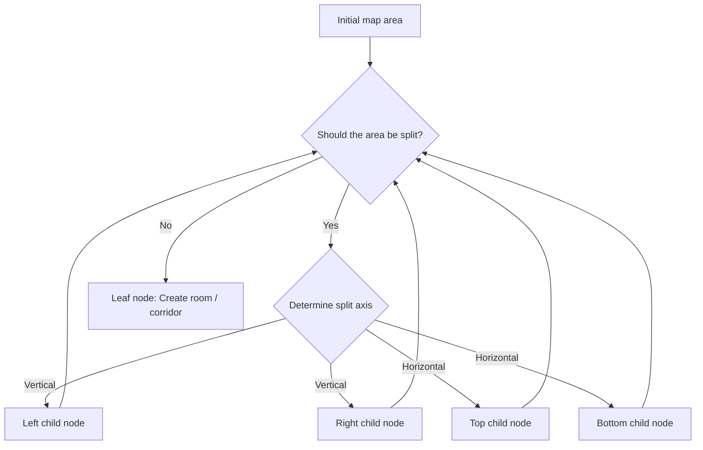
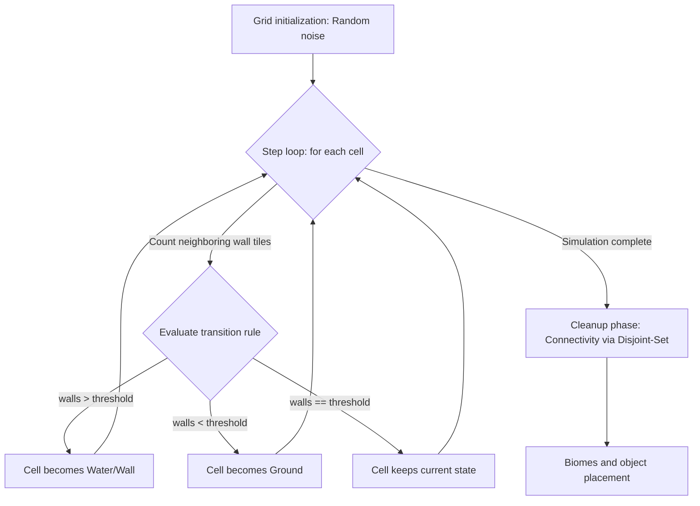
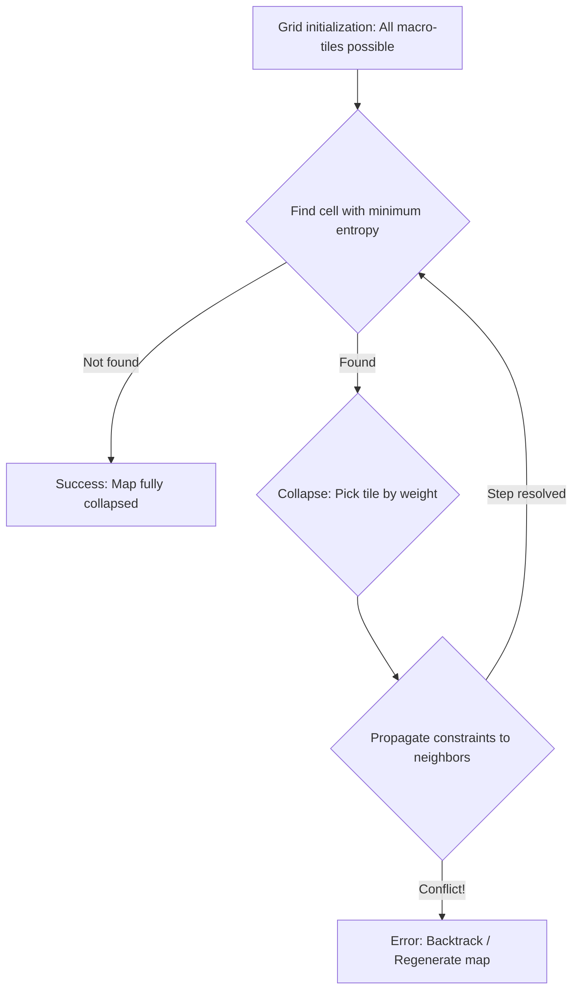

# Algorithmica: Procedural Generation Sandbox 

> **Languages:** [English](README.md) • [Русский](README.ru.md)
> 
## About

**Algorithmica** is an interactive educational sandbox for demonstrating and experimenting with procedural map generation algorithms.

1. **Binary Space Partitioning (BSP)** — for structured room-based layouts (dungeons, buildings).
2. **Cellular Automata (CA)** — for organic, natural environments (caves, islands, biomes).
3. **Wave Function Collapse (WFC)** — a constraint-solving approach for rule-based procedural structures, extended with a hybrid topology layer (BSP-based in this project) for guaranteed macro-level connectivity.
---

### Interactive Features

*    Parameter Tooltips: Hover over any config field to see what it actually does — no guesswork.
*    Diagnostics & Performance: Keep track of generation time (ms) and RAM usage for each layout.
*    Deterministic Seeds: Use seed values to recreate identical layouts — perfect for testing or sharing.
*    Real-Time Tweaking: Adjust map parameters on the fly and watch the map rebuild instantly.

> ⚠️ Some graphical assets are not included due to licensing restrictions. The asset used by the WFC algorithm is prohibited from redistribution under the author's license terms. The project cannot be built independently — links to the original asset packs are listed in the Credits section.

---

## Algorithms Overview

### 1. Binary Space Partitioning (BSP)

**General description:**
BSP recursively divides a 2D area into smaller rectangular sub-zones, building a hierarchical tree. This approach is ideal for generating structured layouts with clear boundaries — dungeon rooms, castle floors, or building interiors.

```mermaid
graph TD
	A[Initial map area] --> B{Should the area be split?};
	B -- Yes --> C{Determine split axis};
	C -- Vertical --> D[Left child node] & E[Right child node];
	C -- Horizontal --> F[Top child node] & G[Bottom child node];
	D --> B;
	E --> B;
	F --> B;
	G --> B;
	B -- No --> H[Leaf node: Create room / corridor];
```

#### Technical implementation:
* **Partition tree:** Implemented via [`BspNode`](source/bsp/models/BspNode.cs), where each node stores its area bounds (`Area`) and references to child branches.
* **Smart axis selection:** [`BspProcessor.TryGetSplitOrientation()`](source/bsp/services/BspProcessor.cs) dynamically picks vertical or horizontal cuts based on the current area's aspect ratio, using `AspectRatioThreshold` from [`BspConfig`](source/bsp/resources/definitions/BspConfig.cs).
* **Size constraints:** The `MinSplitSize` parameter limits split offsets, ensuring child nodes are always large enough to fit rooms with their required padding.
* **Layout generation:** Leaf nodes serve as containers for [`Room`](source/bsp/models/Room.cs) objects, which are then connected via MST pathfinding and corridor generation.

#### Screenshots

*BSP dungeon*

*BSP config panel*

---

### 2. Cellular Automata (CA)

**General description:**
Cellular automata produce organic structures — caves, canyons, islands — by simulating growth or erosion. Each cell on the grid changes state based on its neighbors, transforming random noise into smooth, natural-looking forms.

```mermaid
graph TD
	A[Grid initialization: Random noise] --> B{Step loop: for each cell};
	B -- Count neighboring wall tiles --> C{Evaluate transition rule};
	C -- walls > threshold --> D[Cell becomes Water/Wall];
	C -- walls < threshold --> E[Cell becomes Ground];
	C -- walls == threshold --> F[Cell keeps current state];
	F --> B;
	D --> B;
	E --> B;
	B -- Simulation complete --> G[Cleanup phase: Connectivity via Disjoint-Set];
	G --> H[Biomes and object placement];
```

#### Technical implementation:
* **Grid evolution:** Simulation is driven by [`AutomataSimulator`](source/cellular_automata/services/AutomataSimulator.cs), which evaluates the 3×3 Moore neighborhood for each cell.
* **Transition rules:** Logic is controlled by `FillPercent` (initial fill density) and `WallTransitionThreshold` (threshold at which a cell solidifies).
* **Cleanup and connectivity:** Isolated regions are resolved using a **Union-Find** algorithm inside [`RegionAnalyzer`](source/cellular_automata/services/RegionAnalyzer.cs) and [`RegionConnector`](source/cellular_automata/services/RegionConnector.cs). They identify separate regions, flood-fill to merge them, remove structures smaller than `MinIslandSizeTiles`, and carve corridors to guarantee 100% traversability.
* **Biome layers:** FastNoiseLite integration in [`BiomeCreator`](source/cellular_automata/services/BiomeCreator.cs) overlays noise layers for procedural biome distribution and smooth parameter blending.

#### Screenshots

*Cellular Automata landscape*

*Cellular config panel*

---

### 3. Wave Function Collapse (WFC)

**General description:**
Wave Function Collapse is a constraint-solving algorithm inspired by quantum mechanics. Each cell in the grid starts in a "superposition" of all possible states. By collapsing cells one at a time and propagating constraints to neighbors, the algorithm transforms a chaotic grid into a locally consistent structure that satisfies all adjacency rules — though a plain WFC run offers no guarantee of a solvable, fully connected layout: contradictions can occur, forcing a backtrack or a full regenerate.

To solve this, a **hybrid topology layer** is built on top of standard WFC; in this project, a BSP tree is converted into a level topology graph, and key paths are pre-constrained ahead of the collapse — guaranteeing dungeon connectivity without relying on backtracking.

```mermaid
graph TD
	A[Grid initialization: All macro-tiles possible] --> B{Find cell with minimum entropy};
	B -- Not found --> C[Success: Map fully collapsed];
	B -- Found --> D{Collapse: Pick tile by weight};
	D --> E{Propagate constraints to neighbors};
	E -- Conflict! --> F[Error: Backtrack / Regenerate map];
	E -- Step resolved --> B;
```

#### Technical implementation:
* **Entropy and collapse:** Managed by [`WfcSolver`](source/wfc/services/WfcSolver.cs). The algorithm picks the cell with the fewest valid options (`PickLowestEntropy`) and collapses it to a single tile using weighted probabilities from [`WfcWeightConfig`](source/wfc/resources/definitions/WfcWeightConfig.cs).
* **Constraint propagation:** After each collapse, the solver iteratively narrows valid tile types for neighboring cells based on the socket compatibility table in [`MacroTileSocketMap`](source/wfc/services/MacroTileSocketMap.cs).
* **BSP topology hybrid:** A unique feature of this project — WFC can be overlaid on a macro-structure. When `UseBspTopology` is enabled in [`WfcConfig`](source/wfc/resources/definitions/WfcConfig.cs), the BSP tree is converted into a level topology graph, and [`TopologyPlacer`](source/wfc/services/topology_placer/TopologyPlacer.cs) pre-constrains key paths to guarantee dungeon connectivity.

#### Screenshots

*Pure WFC generation*

*Hybrid WFC generation*

*WFC config panel*

---

## Credits

This project uses high-quality community assets to achieve its visual style. All rights belong to their respective authors:

* **Cellular Automata graphics:**
	* **[Little Dreamyland Asset Pack](https://starmixu.itch.io/little-dreamyland-asset-pack)** by **[starmixu](https://starmixu.itch.io/) and [utaskuas](https://itch.io/profile/utaskuas)**
* **BSP graphics:**
	* **[Dungeon Assetpuck](https://pixel-poem.itch.io/dungeon-assetpuck)** by **[Pixel_Poem](https://pixel-poem.itch.io/)**
* **WFC graphics:**
	* **[Free 2D Top-Down Pixel Dungeon Asset Pack](https://free-game-assets.itch.io/free-2d-top-down-pixel-dungeon-asset-pack)** by **[Free Game Assets (GUI, Sprite, Tilesets)](https://free-game-assets.itch.io/)**
* **UI and onboarding icons (Mouse/Keyboard):**
	* **[Keyboard Keys for UI](https://dreammixgames.itch.io/keyboard-keys-for-ui)** by **[Dream Mix](https://dreammixgames.itch.io/)**
* **Typography (Font):**
	* **[Quaver](https://caffinate.itch.io/quaver)** by **[Caffinate](https://caffinate.itch.io/)** (Pixel font used across all UI panels)

---

## References

Algorithms implemented based on the following works:

* **BSP** — [RogueBasin – Basic BSP Dungeon generation](https://roguebasin.com/index.php/Basic_BSP_Dungeon_generation)
* **CA** — [Johnson, L. Cellular automata for real-time generation of infinite cave levels / L. Johnson, G. N. Yannakakis, J. Togelius](https://www.um.edu.mt/library/oar/bitstream/123456789/22895/1/Cellular_automata_for_real-time_generation_of.pdf)
* **WFC** — [Karth, I. WaveFunctionCollapse is constraint solving in the wild / I. Karth, A. M. Smith](https://adamsmith.as/papers/wfc_isconstraint_solving_in_the_wild.pdf)

---

> **Note on UI, custom themes and graphics:**
> With the exception of in-game tilemaps and the keyboard icon set, the entire application UI was designed, drawn, and implemented from scratch. This includes all visual panels, custom Godot themes, interface buttons, input fields, hand-drawn game icons, and the project's main logotype.
EOF
