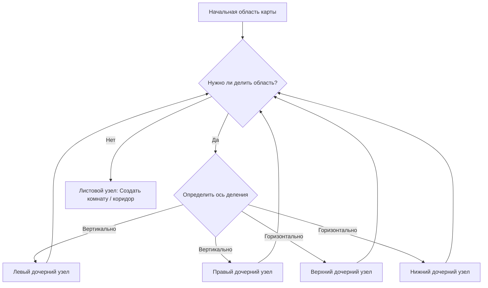
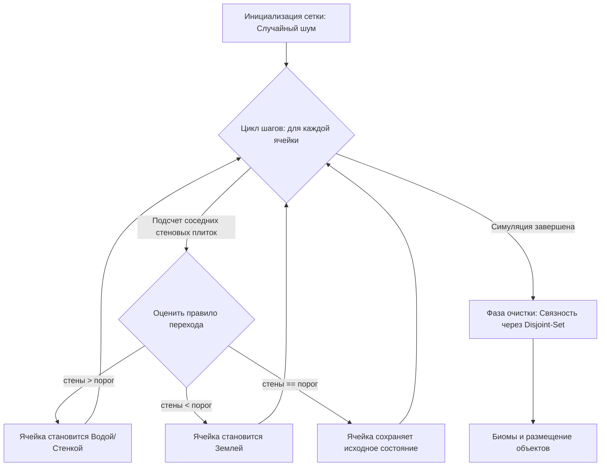
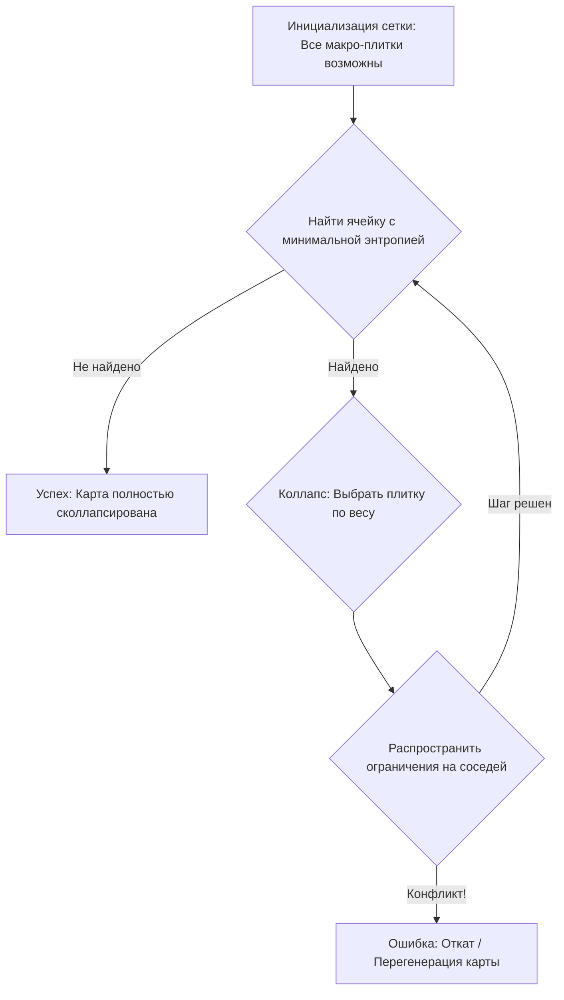

# ProcGen Lab: Лаборатория процедурной генерации миров

> **Языки:** [English](README.md) • [Русский](README.ru.md)

## О проекте

**ProcGen Lab** — это интерактивная платформа, предназначенная для изучения, визуализации и экспериментов с различными алгоритмами процедурной генерации контента (PCG). Она предоставляет гибкую среду для создания разнообразных карт и уровней, подчеркивая при этом внутреннюю логику каждого генератора.

Лаборатория разделена на три основных модуля генерации, каждый из которых использует принципиально иной алгоритмический подход:

1. **Бинарное разбиение пространства (BSP)** — для структурированных планировок с комнатами (подземелья, здания).
2. **Клеточные автоматы (CA)** — для органических, природных окружений (пещеры, острова, биомы).
3. **Коллапс волновой функции (WFC)** — для сложных структур на основе правил и соответствия плиток, а также обеспечения логической связности макроструктур.

---

### Использование лаборатории

В панели управления **ProcGen Lab** вы можете:

* **Настраивать параметры в реальном времени:** Перетаскивайте ползунки и изменяйте минимальные/максимальные размеры комнат, частоты шума, пороги ячеек и веса WFC.
* **Режим отладки визуализатора:** Наблюдайте за тем, как алгоритмы выполняются поэтапно или шаг за шагом: видите, как делятся комнаты или как «сглаживаются» структуры клеточных автоматов в реальном времени!
* **Мониторинг производительности:** Анализируйте время генерации, глубину поиска и нагрузку на систему с помощью встроенных диагностических панелей.

> ⚠️ Часть графических ассетов не включена из-за лицензионных ограничений. Ассет, используемый в алгоритме WFC, запрещён к распространению по условиям лицензии автора. Собрать проект самостоятельно не получится — ссылки на оригинальные паки указаны в разделе «Кредиты».
---

## Технический обзор алгоритмов

### 1. Бинарное разбиение пространства (BSP)

**Общее описание:**
Бинарное разбиение пространства рекурсивно делит 2D-площадь на более мелкие прямоугольные подзоны, создавая иерархическое дерево. Этот метод идеально подходит для создания структурированных планировок с четкими границами (например, комнат в замках или зданий в городах).

**Техническая реализация:**
* **Дерево разбиения:** Реализовано через структуру [`BspNode`](source/bsp/models/BspNode.cs), где каждый узел хранит границы своей области (`Area`) и ссылки на дочерние ветви.
* **Умный выбор оси:** Метод [`BspProcessor.TryGetSplitOrientation()`](source/bsp/services/BspProcessor.cs) динамически определяет направление разреза (вертикальное или горизонтальное) на основе соотношения сторон текущей области, используя `AspectRatioThreshold` из конфигурации [`BspConfig`](source/bsp/resources/definitions/BspConfig.cs).
* **Ограничения размера:** Параметр `MinSplitSize` ограничивает смещения деления, гарантируя, что дочерние узлы всегда имеют достаточный размер для размещения комнат и необходимых отступов.
* **Генерация планировки:** Листовые узлы дерева используются как контейнеры для объектов [`Room`](source/BSP/Models/Room.cs), которые затем соединяются алгоритмами поиска кратчайших путей (MST) и генерации коридоров.

---

### 2. Клеточные автоматы (CA)

**Общее описание:**
Клеточные автоматы создают органические структуры (пещеры, каньоны, острова), имитируя процессы роста или эрозии. Каждая ячейка на сетке меняет свое состояние в зависимости от состояния соседей, что позволяет превращать хаотичный шум в плавные и естественные формы.

**Техническая реализация:**
* **Эволюция сетки:** Процесс симуляции управляется [`AutomataSimulator`](source/cellular_automata/services/AutomataSimulator.cs), который анализирует окрестность 3x3 (соседство Мура) для каждой ячейки.
* **Правила перехода:** Логика переходов опирается на параметры `FillPercent` (начальная плотность заполнения) и `WallTransitionThreshold` (порог срабатывания правила превращения в стену).
* **Очистка и связность:** Для устранения изолированных зон используется алгоритм **Разрешающих множеств (Union-Find)** внутри [`RegionAnalyzer`](source/cellular_automata/services/RegionAnalyzer.cs) и [`RegionConnector`](source/cellular_automata/services/RegionConnector.cs). Они идентифицируют отдельные регионы, выполняют Flood-fill для их объединения, удаляют мелкие объекты меньше `MinIslandSizeTiles` и прокладывают коридоры для обеспечения 100% проходимости.
* **Слои биомов:** Интеграция FastNoiseLite в [`BiomeCreator`](source/cellular_automata/services/BiomeCreator.cs) позволяет накладывать слои шума для процедурного распределения биом и плавного смешивания параметров ландшафта.

---

### 3. Коллапс волновой функции (WFC)

**Общее описание:**
Коллапс волновой функции — это алгоритм решения ограничений, вдохновленный квантовой механикой. Каждая ячейка в сетке изначально находится в «суперпозиции» всех возможных плиток. Поочередно коллапсируя ячейки, алгоритм распространяет ограничения на соседей, превращая хаотичную сетку в полностью согласованную структуру, соответствующую правилам соседства.

**Техническая реализация:**
* **Энтропия и коллапс:** Процесс управляется [`WfcSolver`](source/wfc/services/WfcSolver.cs). Алгоритм выбирает ячейку с наименьшим количеством допустимых вариантов (`PickLowestEntropy`) и коллапсирует её в одну плитку, используя взвешенные вероятности из [`WfcWeightConfig`](source/wfc/resources/Definitions/WfcWeightConfig.cs).
* **Распространение ограничений:** После коллапса решатель итеративно сужает пространство допустимых типов плиток для соседних ячеек на основе таблицы совместимости сокетов в [`MacroTileSocketMap`](source/wfc/services/MacroTileSocketMap.cs).
* **Гибрид топологии BSP:** Уникальная особенность проекта — возможность наложения WFC на макроструктуру. При включении `UseBspTopology` в [`WfcConfig`](source/WFC/resources/Definitions/WfcConfig.cs), дерево BSP преобразуется в граф топологии уровня, а [`TopologyPlacer`](source/wfc/services/topology_placer/TopologyPlacer.cs) предварительно фиксирует ключевые пути, гарантируя связность структур подземелий.

---

## Скриншоты

> *(Скриншоты будут добавлены при публикации на itch.io)*

---

## Кредиты и благодарности за ассеты

Этот проект использует высококачественные ассеты сообщества для достижения визуального стиля. Все права принадлежат их авторам:

* **Графика клеточных автоматов:**
	* **[Little Dreamyland Asset Pack](https://starmixu.itch.io/little-dreamyland-asset-pack)** от **[starmixu](https://starmixu.itch.io/) и [utaskuas](https://itch.io/profile/utaskuas)**
* **Графика бинарного разбиения пространства (BSP):**
	* **[Dungeon Assetpuck](https://pixel-poem.itch.io/dungeon-assetpuck)** от **[Pixel_Poem](https://pixel-poem.itch.io/)**
* **Графика коллапса волновой функции (WFC):**
	* **[Free 2D Top-Down Pixel Dungeon Asset Pack](https://free-game-assets.itch.io/free-2d-top-down-pixel-dungeon-asset-pack)** от **[Free Game Assets (GUI, Sprite, Tilesets)](https://free-game-assets.itch.io/)**
* **Иконки интерфейса и онбординга (Мышь/Клавиатура):**
	* **[Keyboard Keys for UI](https://dreammixgames.itch.io/keyboard-keys-for-ui)** от **[Dream Mix](https://dreammixgames.itch.io/)**
* **Типографика (Шрифт):**
	* **[Quaver](https://caffinate.itch.io/quaver)** от **[Caffinate](https://caffinate.itch.io/)** (Пиксельный шрифт, используемый во всех панелях интерфейса)

---

## Источники и литература

Алгоритмы реализованы на основе следующих материалов:

* **BSP** — [RogueBasin – Basic BSP Dungeon generation](https://roguebasin.com/index.php/Basic_BSP_Dungeon_generation)
* **CA** — [Johnson, L. Cellular automata for real-time generation of infinite cave levels / L. Johnson, G. N. Yannakakis, J. Togelius](https://www.um.edu.mt/library/oar/bitstream/123456789/22895/1/Cellular_automata_for_real-time_generation_of.pdf)
* **WFC** — [Karth, I. WaveFunctionCollapse is constraint solving in the wild / I. Karth, A. M. Smith](https://adamsmith.as/papers/wfc_isconstraint_solving_in_the_wild.pdf)

---

> **Примечание по UI, кастомным темам и графике:**
> За исключением внутриигровых тайлмапов и набора иконок клавиатуры, весь пользовательский интерфейс приложения был спроектирован, отрисован и реализован мной с нуля. Это включает в себя все визуальные панели, кастомные темы Godot, кнопки интерфейса, поля ввода, нарисованные вручную игровые иконки и основной логотип проекта.
