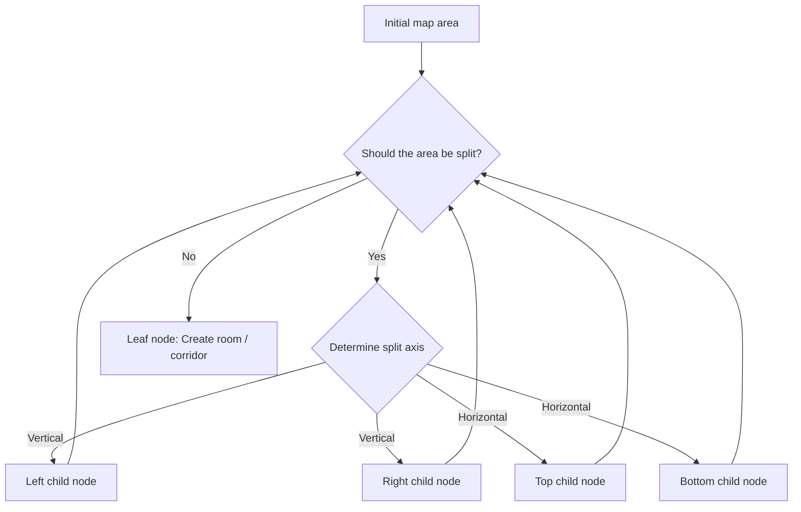
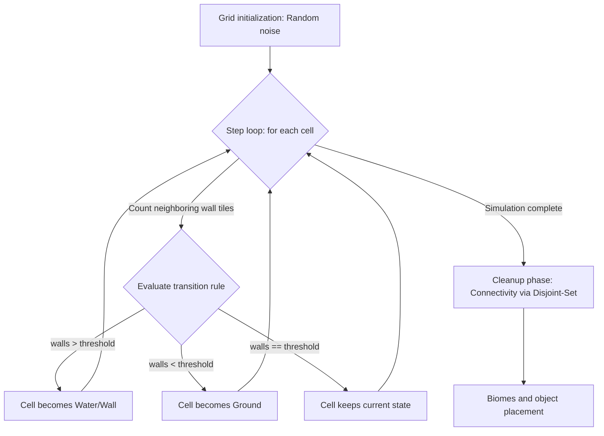
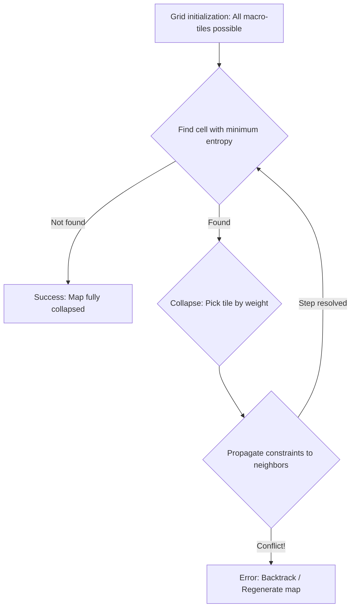

# Algorithmica: Песочница процедурной генерации

> **Языки:** [English](README.md) • [Русский](README.ru.md)
>
## О проекте

**Algorithmica** — интерактивная образовательная песочница для демонстрации и экспериментов с алгоритмами процедурной генерации карт.

1. **Binary Space Partitioning (BSP)** — для структурированных планировок на основе комнат (подземелья, здания).
2. **Cellular Automata (CA)** — для органичных, естественных ландшафтов (пещеры, острова, биомы).
3. **Wave Function Collapse (WFC)** — подход на основе решения ограничений для процедурных структур, подчиняющихся заданным правилам, дополненный гибридным слоем топологии (в данном проекте — на основе BSP) для гарантированной связности на макроуровне.

---

### Интерактивные возможности

*    Подсказки к параметрам: наведи курсор на любое поле конфигурации, чтобы узнать, за что оно отвечает — никакого угадывания.
*    Диагностика и производительность: отслеживание времени генерации (мс) и потребления памяти для каждой карты.
*    Детерминированные сиды: используй значения сида, чтобы воспроизводить одинаковые карты — удобно для тестирования и обмена результатами.
*    Настройка в реальном времени: меняй параметры карты на лету и сразу видь пересборку.

> ⚠️ Часть графических ассетов не включена в репозиторий из-за лицензионных ограничений. Ассет, используемый алгоритмом WFC, запрещён к распространению условиями лицензии автора. Проект нельзя собрать самостоятельно без этих ассетов — ссылки на оригинальные наборы указаны в разделе Credits.

---

## Обзор алгоритмов

### 1. Binary Space Partitioning (BSP)

**Общее описание:**
BSP рекурсивно делит 2D-область на более мелкие прямоугольные подзоны, строя иерархическое дерево. Этот подход идеально подходит для генерации структурированных планировок с чёткими границами — комнат подземелья, этажей замка или интерьеров зданий.

```mermaid
graph TD
	A[Initial map area] --> B{Should the area be split?};
	B -- Yes --> C{Determine split axis};
	C -- Vertical --> D[Left child node] & E[Right child node];
	C -- Horizontal --> F[Top child node] & G[Bottom child node];
	D --> B;
	E --> B;
	F --> B;
	G --> B;
	B -- No --> H[Leaf node: Create room / corridor];
```

#### Техническая реализация:
* **Дерево разбиения:** реализовано через [`BspNode`](source/bsp/models/BspNode.cs), где каждый узел хранит границы своей области (`Area`) и ссылки на дочерние ветви.
* **Умный выбор оси разбиения:** [`BspProcessor.TryGetSplitOrientation()`](source/bsp/services/BspProcessor.cs) динамически выбирает вертикальное или горизонтальное разбиение на основе соотношения сторон текущей области, используя `AspectRatioThreshold` из [`BspConfig`](source/bsp/resources/definitions/BspConfig.cs).
* **Ограничения размера:** параметр `MinSplitSize` ограничивает смещение разбиения, гарантируя, что дочерние узлы всегда достаточно велики для размещения комнат с необходимыми отступами.
* **Генерация планировки:** листовые узлы служат контейнерами для объектов [`Room`](source/bsp/models/Room.cs), которые затем соединяются через MST-поиск пути и генерацию коридоров.

#### Скриншоты

*Подземелье, сгенерированное BSP*

*Панель конфигурации BSP*

---

### 2. Cellular Automata (CA)

**Общее описание:**
Клеточные автоматы создают органичные структуры — пещеры, каньоны, острова — симулируя рост или эрозию. Каждая клетка сетки меняет состояние на основе состояния соседей, превращая случайный шум в гладкие, естественно выглядящие формы.

```mermaid
graph TD
	A[Grid initialization: Random noise] --> B{Step loop: for each cell};
	B -- Count neighboring wall tiles --> C{Evaluate transition rule};
	C -- walls > threshold --> D[Cell becomes Water/Wall];
	C -- walls < threshold --> E[Cell becomes Ground];
	C -- walls == threshold --> F[Cell keeps current state];
	F --> B;
	D --> B;
	E --> B;
	B -- Simulation complete --> G[Cleanup phase: Connectivity via Disjoint-Set];
	G --> H[Biomes and object placement];
```

#### Техническая реализация:
* **Эволюция сетки:** симуляция управляется [`AutomataSimulator`](source/cellular_automata/services/AutomataSimulator.cs), который оценивает окрестность Мура 3×3 для каждой клетки.
* **Правила перехода:** логика контролируется параметрами `FillPercent` (начальная плотность заполнения) и `WallTransitionThreshold` (порог, при котором клетка становится стеной).
* **Очистка и связность:** изолированные регионы разрешаются алгоритмом **Union-Find** внутри [`RegionAnalyzer`](source/cellular_automata/services/RegionAnalyzer.cs) и [`RegionConnector`](source/cellular_automata/services/RegionConnector.cs). Они выявляют отдельные регионы, объединяют их через flood-fill, удаляют структуры меньше `MinIslandSizeTiles` и прокладывают коридоры, гарантируя 100% проходимость.
* **Слои биомов:** интеграция FastNoiseLite в [`BiomeCreator`](source/cellular_automata/services/BiomeCreator.cs) накладывает слои шума для процедурного распределения биомов и плавного смешения параметров.

#### Скриншоты

*Ландшафт, сгенерированный клеточными автоматами*

*Панель конфигурации клеточных автоматов*

---

### 3. Wave Function Collapse (WFC)

**Общее описание:**
Коллапс волновой функции — это алгоритм решения ограничений, вдохновлённый квантовой механикой. Каждая ячейка сетки изначально находится в «суперпозиции» всех возможных состояний. Поочерёдно коллапсируя ячейки и распространяя ограничения на соседей, алгоритм превращает хаотичную сетку в локально согласованную структуру, соответствующую правилам соседства — однако сам по себе WFC не гарантирует решаемую и полностью связную структуру: возможны конфликты, требующие отката или полной регенерации карты.

Чтобы решить эту проблему, поверх стандартного WFC создаётся **гибридный слой топологии**; в данном проекте дерево BSP преобразуется в граф топологии уровня, а ключевые пути фиксируются заранее, до коллапса — это гарантирует связность подземелья без опоры на откат.

```mermaid
graph TD
	A[Grid initialization: All macro-tiles possible] --> B{Find cell with minimum entropy};
	B -- Not found --> C[Success: Map fully collapsed];
	B -- Found --> D{Collapse: Pick tile by weight};
	D --> E{Propagate constraints to neighbors};
	E -- Conflict! --> F[Error: Backtrack / Regenerate map];
	E -- Step resolved --> B;
```

#### Техническая реализация:
* **Энтропия и коллапс:** процесс управляется [`WfcSolver`](source/wfc/services/WfcSolver.cs). Алгоритм выбирает ячейку с наименьшим числом допустимых вариантов (`PickLowestEntropy`) и коллапсирует её в одну плитку, используя взвешенные вероятности из [`WfcWeightConfig`](source/wfc/resources/definitions/WfcWeightConfig.cs).
* **Распространение ограничений:** после каждого коллапса решатель итеративно сужает набор допустимых типов плиток для соседних ячеек на основе таблицы совместимости сокетов в [`MacroTileSocketMap`](source/wfc/services/MacroTileSocketMap.cs).
* **Гибрид с топологией BSP:** уникальная особенность проекта — WFC может накладываться поверх макроструктуры. При включении `UseBspTopology` в [`WfcConfig`](source/wfc/resources/definitions/WfcConfig.cs) дерево BSP преобразуется в граф топологии уровня, а [`TopologyPlacer`](source/wfc/services/topology_placer/TopologyPlacer.cs) заранее фиксирует ключевые пути, гарантируя связность подземелья.

#### Скриншоты

*Генерация чистым WFC*

*Гибридная генерация WFC*

*Панель конфигурации WFC*

---

## Credits

В проекте используются качественные ассеты от сообщества. Все права принадлежат их авторам:

* **Графика клеточных автоматов:**
    * **[Little Dreamyland Asset Pack](https://starmixu.itch.io/little-dreamyland-asset-pack)** от **[starmixu](https://starmixu.itch.io/) и [utaskuas](https://itch.io/profile/utaskuas)**
* **Графика BSP:**
    * **[Dungeon Assetpuck](https://pixel-poem.itch.io/dungeon-assetpuck)** от **[Pixel_Poem](https://pixel-poem.itch.io/)**
* **Графика WFC:**
    * **[Free 2D Top-Down Pixel Dungeon Asset Pack](https://free-game-assets.itch.io/free-2d-top-down-pixel-dungeon-asset-pack)** от **[Free Game Assets (GUI, Sprite, Tilesets)](https://free-game-assets.itch.io/)**
* **Иконки интерфейса и обучения (мышь/клавиатура):**
    * **[Keyboard Keys for UI](https://dreammixgames.itch.io/keyboard-keys-for-ui)** от **[Dream Mix](https://dreammixgames.itch.io/)**
* **Шрифт:**
    * **[Quaver](https://caffinate.itch.io/quaver)** от **[Caffinate](https://caffinate.itch.io/)** (пиксельный шрифт, используемый во всех UI-панелях)

---

## Источники

Алгоритмы реализованы на основе следующих работ:

* **BSP** — [RogueBasin – Basic BSP Dungeon generation](https://roguebasin.com/index.php/Basic_BSP_Dungeon_generation)
* **CA** — [Johnson, L. Cellular automata for real-time generation of infinite cave levels / L. Johnson, G. N. Yannakakis, J. Togelius](https://www.um.edu.mt/library/oar/bitstream/123456789/22895/1/Cellular_automata_for_real-time_generation_of.pdf)
* **WFC** — [Karth, I. WaveFunctionCollapse is constraint solving in the wild / I. Karth, A. M. Smith](https://adamsmith.as/papers/wfc_isconstraint_solving_in_the_wild.pdf)

---

> **Примечание об интерфейсе, кастомных темах и графике:**
> За исключением тайлмапов внутри игры и набора иконок клавиатуры, весь интерфейс приложения спроектирован, отрисован и реализован с нуля. Это касается всех визуальных панелей, кастомных тем Godot, кнопок интерфейса, полей ввода, нарисованных вручную игровых иконок и основного логотипа проекта.
